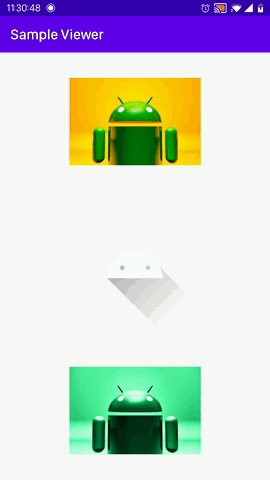

# ImageStackViewer
This library provides an activity to show images

image::https://img.shields.io/:license-Apache%202.0-yellowgreen.svg[]

image::https://img.shields.io/badge/version-1.0.0-green.svg[]

image::https://img.shields.io/badge/minSDK-19-blue.svg[]

## Preview

## Requirements

Add line below to your *top* level build.gradle

[source,bourne]
----
allprojects {
    repositories {
        /// ....
        maven { url "https://jitpack.io" }
    }
}
----

Add lines below to your *app* level build.gradle

[source,bourne]
----
    implementation "androidx.viewpager2:viewpager2:1.0.0"
    implementation 'com.github.bumptech.glide:glide:4.11.0'
    implementation 'com.jsibbold:zoomage:1.3.1'
    implementation 'com.github.mayuce:ImageStackViewer:1.0.0'
----

And Sync the gradle

## Usage

[source,kotlin]
----
    ....
        companion object {
        private const val TEST_URL =
            "test.png"

        private const val TEST_URL_2 =
            "test2.png"
    }
    ...
    
    StackImageViewer.openStackViewer(
                activity = this,
                list = listOf(
                    ImageData(ResourceType.UrlResource(TEST_URL)),
                    ImageData(ResourceType.AppResource(R.drawable.ic_launcher_foreground)),
                    ImageData(ResourceType.UrlResource(TEST_URL_2)),
                    ....
                ), selectedItemPose = 1, view = imageView
            )
----

If you don't want to *makeSceneTransitionAnimation* don't pass the imageView.
selectedItemPose parameter defines which image should show first when view initialized.

There is 3 type of images supportes. These are *app resource, URL & Base64*.

## TO-DO

- Changing background color with image.
